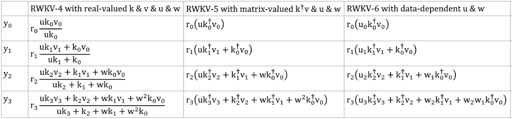

# RWKV: Parallelizable RNN with Transformer-level LM Performance , named from 4 major params: R W K V

RWKV(pronounced as "RwaKuv" (rʌkuv in IPA)) is an RNN with Transformer-level LLM performance, which can also be directly trained like a GPT transformer (parallelizable). And it's 100% attention-free. You only need the hidden state at position t to compute the state at position t+1. You can use the "GPT" mode to quickly compute the hidden state for the "RNN" mode.

So it's combining the best of RNN and transformer - **great performance, fast inference, saves VRAM, fast training, "infinite" ctx_len, and free sentence embedding** (using the final hidden state).


## Main Links Of RWKV 

- **RWKV homepage:** https://www.rwkv.com

- **RWKV Discord**: https://discord.gg/bDSBUMeFpc (7k+ members)

- **Twitter**: https://twitter.com/BlinkDL_AI

- **Online Demo 1(RWKV-6 3B):**  https://huggingface.co/spaces/BlinkDL/RWKV-Gradio-1

- **Online Demo 2(RWKV-6 7B):**  https://huggingface.co/spaces/BlinkDL/RWKV-Gradio-2

- **All latest RWKV weights:** https://huggingface.co/BlinkDL

- **HF-compatible RWKV weights:** https://huggingface.co/RWKV

- **RWKV pip package**: https://pypi.org/project/rwkv/

```python
os.environ["RWKV_JIT_ON"] = '1'
os.environ["RWKV_CUDA_ON"] = '0' # if '1' then use CUDA kernel for seq mode (much faster)
from rwkv.model import RWKV                         # pip install rwkv
model = RWKV(model='/fsx/BlinkDL/HF-MODEL/rwkv-4-pile-1b5/RWKV-4-Pile-1B5-20220903-8040', strategy='cuda fp16')

out, state = model.forward([187, 510, 1563, 310, 247], None)   # use 20B_tokenizer.json
print(out.detach().cpu().numpy())                   # get logits
out, state = model.forward([187, 510], None)
out, state = model.forward([1563], state)           # RNN has state (use deepcopy if you want to clone it)
out, state = model.forward([310, 247], state)
print(out.detach().cpu().numpy())                   # same result as above
```

## RWKV Architecture

The latest architecture of RWKV is v6 , refer to the paper :

- **RWKV-5/6 (Eagle/Finch) paper**: https://arxiv.org/abs/2404.05892

RWKV v6 illustrated:


You can learn about the architecture of RWKV-V6 at the following link:

- **RWKV-6 GPT-mode demo code (with comments and explanations)**: https://github.com/BlinkDL/RWKV-LM/blob/main/RWKV-v5/rwkv_v6_demo.py

- **RWKV-6 RNN-mode demo in 250 lines(with tokenizer too):** https://github.com/BlinkDL/ChatRWKV/blob/main/RWKV_v6_demo.py

- **RWKV v5 in 250 lines** (with tokenizer too): https://github.com/BlinkDL/ChatRWKV/blob/main/RWKV_v5_demo.py

and try it with online Demo :

### Older Architecture

The RWKV community published the first paper on the V4 architecture. See :

- **RWKV v4 preprint** https://arxiv.org/abs/2305.13048


- **RWKV v4 in 150 lines** (model, inference, text generation): https://github.com/BlinkDL/ChatRWKV/blob/main/RWKV_in_150_lines.py

**RWKV v4 introduction, and in 100 lines of numpy**: https://johanwind.github.io/2023/03/23/rwkv_overview.html https://johanwind.github.io/2023/03/23/rwkv_details.html

Due to outdated architecture design, the earlier RWKV architecture (V3/V2/V1) is only used as a historical archive.

### Design & Ideas Of RWKV Architecture

#### RWKV-4 / RWKV-5

RWKV-5 is multi-head and here shows one head. There is also a LayerNorm for each head (hence actually GroupNorm).

$`
\begin{array}{|l|l|l|}
\hline & \text { RWKV-4 with real-valued } k \,\&\, v \,\&\, u \,\&\, w & \text { RWKV-5 with matrix-valued } \mathrm{k}^{\dagger} \mathrm{v} \,\&\, \mathrm{u} \,\&\, \mathrm{w} \\
\hline \mathrm{y}_0 & \mathrm{r}_0 \frac{\mathrm{uk}_0 \mathrm{v}_0}{\mathrm{uk}_0} & \mathrm{r}_0\left(\mathrm{uk}_0^{\dagger} \mathrm{v}_0\right) \\
\hline \mathrm{y}_1 & \mathrm{r}_1 \frac{\mathrm{uk}_1 \mathrm{v}_1+\mathrm{k}_0 \mathrm{v}_0}{\mathrm{uk}_1+\mathrm{k}_0} & \mathrm{r}_1\left(\mathrm{uk}_1^{\dagger} \mathrm{v}_1+\mathrm{k}_0^{\dagger} \mathrm{v}_0\right) \\
\hline \mathrm{y}_2 & \mathrm{r}_2 \frac{\mathrm{uk}_2 \mathrm{v}_2+\mathrm{k}_1 \mathrm{v}_1+\mathrm{wk}_0 \mathrm{v}_0}{\mathrm{uk}_2+\mathrm{k}_1+\mathrm{wk}_0} & \mathrm{r}_2\left(\mathrm{uk}_2^{\dagger} \mathrm{v}_2+\mathrm{k}_1^{\dagger} \mathrm{v}_1+\mathrm{wk}_0^{\dagger} \mathrm{v}_0\right) \\
\hline \mathrm{y}_3 & \mathrm{r}_3 \frac{\mathrm{uk}_3 \mathrm{v}_3+\mathrm{k}_2 \mathrm{v}_2+\mathrm{wk}_1 \mathrm{v}_1+\mathrm{w}^2 \mathrm{k}_0 \mathrm{v}_0}{\mathrm{uk}_3+\mathrm{k}_2+\mathrm{wk}_1+\mathrm{w}^2 \mathrm{k}_0} & \mathrm{r}_3\left(\mathrm{uk}_3^{\dagger} \mathrm{v}_3+\mathrm{k}_2^{\dagger} \mathrm{v}_2+\mathrm{wk}_1^{\dagger} \mathrm{v}_1+\mathrm{w}^2 \mathrm{k}_0^{\dagger} \mathrm{v}_0\right) \\
\hline
\end{array}`$

$`\left[\begin{array}{ll}
\mathrm{y}_{20} & \cdots \mathrm{y}_{2 \mathrm{c}}
\end{array}\right]=\left[\begin{array}{lll}
\mathrm{r}_{20} & \cdots & \mathrm{r}_{2 \mathrm{c}}
\end{array}\right]`$
$`\left(\left[\begin{array}{ccc}
\mathrm{u}_{00} & \cdots & \mathrm{u}_{0 \mathrm{c}} \\
\vdots & \ddots & \vdots \\
\mathrm{u}_{\mathrm{c} 0} & \cdots & \mathrm{u}_{\mathrm{cc}}
\end{array}\right]\left[\begin{array}{ccc}
\mathrm{k}_{20} \mathrm{v}_{20} & \cdots & \mathrm{k}_{20} \mathrm{v}_{2 \mathrm{c}} \\
\vdots & \ddots & \vdots \\
\mathrm{k}_{2 \mathrm{c}} \mathrm{v}_{20} & \cdots & \mathrm{k}_{2 \mathrm{c}} \mathrm{v}_{2 \mathrm{c}}
\end{array}\right]+\left[\begin{array}{ccc}
\mathrm{k}_{10} \mathrm{v}_{10} & \cdots & \mathrm{k}_{10} \mathrm{v}_{1 \mathrm{c}} \\
\vdots & \ddots & \vdots \\
\mathrm{k}_{1 \mathrm{c}} \mathrm{v}_{10} & \cdots & \mathrm{k}_{1 \mathrm{c}} \mathrm{v}_{1 \mathrm{c}}
\end{array}\right]+\left[\begin{array}{ccc}
\mathrm{w}_{00} & \cdots & \mathrm{w}_{0 \mathrm{c}} \\
\vdots & \ddots & \vdots \\
\mathrm{w}_{\mathrm{c} 0} & \cdots & \mathrm{w}_{\mathrm{cc}}
\end{array}\right]\left[\begin{array}{ccc}
\mathrm{k}_{00} \mathrm{v}_{00} & \cdots & \mathrm{k}_{00} \mathrm{v}_{0 c} \\
\vdots & \ddots & \vdots \\
\mathrm{k}_{0 \mathrm{c}} \mathrm{v}_{00} & \cdots & \mathrm{k}_{0 \mathrm{c}} \mathrm{v}_{0 c}
\end{array}\right]
\right)`$

#### RWKV-6

Dynamic Mix & Dynamic Decay. Example (do this for both TimeMix & ChannelMix):
```
TIME_MIX_EXTRA_DIM = 32
self.time_mix_k_w1 = nn.Parameter(torch.empty(args.n_embd, TIME_MIX_EXTRA_DIM).uniform_(-0.01, 0.01))
self.time_mix_k_w2 = nn.Parameter(torch.zeros(TIME_MIX_EXTRA_DIM, args.n_embd))
self.time_mix_v_w1 = nn.Parameter(torch.empty(args.n_embd, TIME_MIX_EXTRA_DIM).uniform_(-0.01, 0.01))
self.time_mix_v_w2 = nn.Parameter(torch.zeros(TIME_MIX_EXTRA_DIM, args.n_embd))
self.time_mix_r_w1 = nn.Parameter(torch.empty(args.n_embd, TIME_MIX_EXTRA_DIM).uniform_(-0.01, 0.01))
self.time_mix_r_w2 = nn.Parameter(torch.zeros(TIME_MIX_EXTRA_DIM, args.n_embd))
self.time_mix_g_w1 = nn.Parameter(torch.empty(args.n_embd, TIME_MIX_EXTRA_DIM).uniform_(-0.01, 0.01))
self.time_mix_g_w2 = nn.Parameter(torch.zeros(TIME_MIX_EXTRA_DIM, args.n_embd))
...
time_mix_k = self.time_mix_k.view(1,1,-1) + (x @ self.time_mix_k_w1) @ self.time_mix_k_w2
time_mix_v = self.time_mix_v.view(1,1,-1) + (x @ self.time_mix_v_w1) @ self.time_mix_v_w2
time_mix_r = self.time_mix_r.view(1,1,-1) + (x @ self.time_mix_r_w1) @ self.time_mix_r_w2
time_mix_g = self.time_mix_g.view(1,1,-1) + (x @ self.time_mix_g_w1) @ self.time_mix_g_w2

xx = self.time_shift(x)
xk = x * time_mix_k + xx * (1 - time_mix_k)
xv = x * time_mix_v + xx * (1 - time_mix_v)
xr = x * time_mix_r + xx * (1 - time_mix_r)
xg = x * time_mix_g + xx * (1 - time_mix_g)
```



#### RWKV-7

Use parallelized mode to quickly generate the state, then use a finetuned full RNN (the layers of token n can use outputs of all layer of token n-1) for sequential generation.

---
## TRAINING

### Environmen For Training RWKV

> [!IMPORTANT]
>
> Before training the RWKV model, ensure that you have set up the appropriate environment.

For reference, use python 3.10, torch==1.13.1+cu117, cuda 11.7.1.

For best performance, use python 3.10, torch 2.1.2+cu121 (or latest), cuda 12.3+, **latest deepspeed**, but **keep pytorch-lightning==1.9.5**

```bash
reference:
pip install torch==1.13.1+cu117 --extra-index-url https://download.pytorch.org/whl/cu117
pip install pytorch-lightning==1.9.5 deepspeed==0.7.0 wandb ninja

best performance:
pip install torch --upgrade --extra-index-url https://download.pytorch.org/whl/cu121
pip install pytorch-lightning==1.9.5 deepspeed wandb ninja --upgrade
```

### HOW TO TEST TRAINING RWKV-5 on MiniPile (1.5G tokens) ？

#### Download MiniPile Dataset

```
# mkdir -p data
# wget --continue -O data/minipile.idx https://huggingface.co/datasets/BlinkDL/minipile-tokenized/resolve/main/rwkv_vocab_v20230424/minipile.idx
# wget --continue -O data/minipile.bin https://huggingface.co/datasets/BlinkDL/minipile-tokenized/resolve/main/rwkv_vocab_v20230424/minipile.bin
```
#### Start Training

```
cd RWKV-v5/
./demo-training-prepare.sh
./demo-training-run.sh
(you may want to log in to wandb first)
```
Your loss curve should look almost exactly the same as this, with the same ups and downs (if you use the same bsz & config):


You can run your model using https://pypi.org/project/rwkv/ (use "rwkv_vocab_v20230424" instead of "20B_tokenizer.json")

### HOW TO FINETUNE RWKV-5 MODELS

#### Step 1: Preparing dataset

Follow the steps to prepare your training dataset.

1. **Collect jsonl data**

Organize your data into JSONL files, refer to the format:

```text
# Single-turn dialogue
{“text”: “User: Question\n\nAssistant: Answer”}

# Multi-turn dialogue
 {“text”: “User: First question\n\nAssistant: First answer\n\nUser: Second question\n\nAssistant: Second answer”}

# Material-based Q&A
{“text”: “Instruction: Directive\n\nInput: Material\n\nResponse: Answer”}

# Content generation/continuation
 {“text”: “Transform the content of each article into one line of JSONL, even if it is a novel of one million words.”} or {“text”: “Title\n\nMain text content”}
```

2. **Convert jsonl data to binidx**

Use [`RWKV-v5/make_data.py`](https://github.com/BlinkDL/RWKV-LM/blob/main/RWKV-v5/make_data.py) to prepare binidx data ( suitable for finetuning RWKV-World models) from your jsonl file , and compute "`--my_exit_tokens`" and "`--magic_prime`".

**usage:**

```python
python make_data.py demo.jsonl 3 4096
```

**This will:**
- shuffle & duplicate demo.jsonl (for 3 epochs, good for finetuning) 
- load jsonl and tokenize
- convert `demo.jsonl` to binidx data,save as `demo.bin` & `demo.idx`
- compute "`magic_prime`" for ctxlen 4096 

>[!TIP] SFT jsonl data 
>
>simple SFT: repeat your SFT data 3 or 4 times in `make_data.py`. more repetition leads to overfitting.
>
>advanced SFT: repeat your SFT data 3 or 4 times in your jsonl (note: `make_data.py` will shuffle all jsonl items) => add some base data (such as slimpajama) to your jsonl => and only repeat 1 times in make_data.py.

#### Modifying Training Parameters

> [!TIP]
> All training parameters can be modified in `demo-training-run.sh`. Modifying training parameters will affect the training process and model training effect.

**Parameters that must be modified**
```bash
--load_model # Path to base RWKV model 
--proj_dir # Path to save the trained model
--data_file # Path to the data file, no need `.bin` or `.idx` for binidx data , just the filename
--n_layer # according to the Size of the model
--n_embd # according to the Size of the model
--my_exit_tokens # tokens number of the training data
--magic_prime # Prime number related to my_exit_tokens / ctx_len
```
- `--n_layer` and `--n_embd` need to be adjusted according to the Size of the model:

| RWKV Model Size | n_layer | n_embd |
|------------|---------|--------|
| 0.1B       | 12      | 768    |
| 0.4B       | 24      | 1024   |
| 1.5B       | 24      | 2048   |
| 3B         | 32      | 2560   |
| 7B         | 32      | 4096   |

- `--my_exit_tokens`" and "`--magic_prime` should be computed when using `RWKV-v5/make_data.py` . If you get a ready-made bindix dataset, you can manually calculate its `--magic_prime` parameter :

> [!NOTE] --my_exit_tokens and --magic_prime
> The "epoch" in `train.py` is "mini-epoch" (not real epoch. only for convenience), and 1 mini-epoch = 40320 * ctx_len tokens.
> 
> For example, if your binidx has 1498226207 tokens and ctxlen=4096, set "`--my_exit_tokens 1498226207`" (this will override `epoch_count`), and it will be 1498226207/(40320 * 4096) = 9.07 miniepochs. The trainer will auto-exit after "`--my_exit_tokens`" tokens. 
> 
> Set "`--magic_prime`" to the largest 3n+2 prime smaller than datalen/ctxlen-1 (= 1498226207/4096-1 = 365776), which is "--magic_prime 365759" in this case.

**Parameters can keep the default value**
```bash
--my_testing x060 # base model type, x060 => rwkv-6.0 , x052 => rwkv-5.2
--ctx_len # Maximum context length, if modifying this value, remember to also compute and modify --magic_prime
--my_pile_stage 3 # Set to 1 for generating rwkv-init.pth,  3 for training
--epoch_count 999999 # Total training epochs, will be overridden by --my_exit_tokens parameter
--epoch_begin 0 # Initial training epoch, indicating to start loading from the N-th epoch
--my_exit_tokens 1498226207 # Stop training after reaching the specified number of tokens, depending on your dataset size
--magic_prime 2926181 # Prime number related to my_exit_tokens / ctx_len, refer to previous text for specific calculations
--num_nodes 1 # Number of nodes
--micro_bsz 16 # Micro batch size (batch size per GPU), increasing it may be better but takes more VRAM
--pre_ffn 0 # Replace the first att layer with ffn,default 0 (sometimes 1 better)
--head_qk 0 # Usually keep the default value 0 (off)
--lr_init # Initial learning rate, use smaller values like 1e-5 for fine-tuning
--lr_final # Final learning rate, use smaller values like 1e-5 for fine-tuning
--warmup_steps 10 # Warm-up steps, try 50 if loading a model
--beta1 0.9 # Beta1 parameter of Adam optimizer, usually 0.9
--beta2 0.99 # Beta2 parameter of Adam optimizer, use 0.999 when nearing convergence
--adam_eps 1e-8 # Epsilon parameter of Adam optimizer, usually 1e-8
--my_pile_edecay 0 # Pile decay setting, usually set to 0
--data_type binidx # Format of training  data, supports "utf-8", "utf-16le", "numpy", "binidx", "dummy", "wds_img", "uint16"
--vocab_size # Vocabulary size, default 65536, setting to 0 means the model will determine the vocabulary size automatically
--weight_decay 0.001 # Weight decay, default 0.001, can try 0.1 / 0.01 / 0.001
--epoch_save 10 # Save the trained model every 10 "miniepochs" ，mind your storage space when set to smaller.
--head_size_a 64 # Size of attention head, default 64, can try increasing this value for larger training models
--accelerator gpu # Type of accelerator, though options are cpu/gpu, currently cpu does not support training
--devices 1 # 1 for single GPU, fill in the number of GPUs for multiple cards
--precision bf16 # Training precision, default bf16, supports "fp32", "tf32", "fp16", "bf16"
--strategy deepspeed_stage_2 # Training strategy parameter for lightning, default deepspeed_stage_2
--grad_cp 1 # Gradient accumulation steps, 1 => slower training & save VRAM; 0 => faster & need more VRAM
--enable_progress_bar # Enable progress bar
--ds_bucket_mb 2 # Deep learning speed size, set to 2 for consumer GPUs,200 for A100 / H100 (affects speed & vram usage)
```

#### Start Training

Rename the base checkpoint in your model folder to `rwkv-init.pth`, run `demo-training-run.sh`:
```sh
cd RWKV-v5/
./demo-training-prepare.sh
./demo-training-run.sh
(you may want to log in to wandb first)
```
---
### State-tuning (tuning the initial state. zero inference overhead)

Currently unoptimized implementation, takes same vram as full SFT .

Modify parameters in `demo-training-run.sh`:

```SH
--train_type "states" 
--load_partial 1 
--lr_init 1 # (yes, use very high LR)
--lr_final 0.01 
--warmup_steps 10 
```

use rwkv 0.8.26+ to auto-load the trained "time_state" 

### Initializing RWKV 5/6 Models

When you train RWKV from scratch, try my initialization for best performance. Check generate_init_weight() of src/model.py:
```
emb.weight => nn.init.uniform_(a=-1e-4, b=1e-4)
(Note ln0 of block0 is the layernorm for emb.weight)
head.weight => nn.init.orthogonal_(gain=0.5*sqrt(n_vocab / n_embd))

att.receptance.weight => nn.init.orthogonal_(gain=1)
att.key.weight => nn.init.orthogonal_(gain=0.1)
att.value.weight => nn.init.orthogonal_(gain=1)
att.gate.weight => nn.init.orthogonal_(gain=0.1)
att.output.weight => zero

att.ln_x.weight (groupnorm) => ((1 + layer_id) / total_layers) ** 0.7

ffn.key.weight => nn.init.orthogonal_(gain=1)
ffn.value.weight => zero
ffn.receptance.weight => zero
```

> [!IMPORTANT]
> 
> If you are using positional embedding, maybe it's better to remove block.0.ln0 and use default initialization for emb.weight instead of my uniform_(a=-1e-4, b=1e-4) 

### Additional Content For Training

> [!TIP] Tips for small model / small data:
> 
>  When I train RWKV music models, I use deep & narrow (such as L29-D512) dimensions, and apply wd and dropout (such as `wd=2` , `dropout=0.02`).
> 
>  Note RWKV-LM dropout is very effective - use `1/4` of your usual value.

- **Train RWKV-6:** use /RWKV-v5/ , and add `--my_testing "x060"` to `demo-training-prepare.sh` and `demo-training-run.sh` .

- **Simple inference for RWKV-5**: https://github.com/BlinkDL/ChatRWKV/blob/main/RWKV_v5_demo.py

- **Simple inference for RWKV-6**: https://github.com/BlinkDL/ChatRWKV/blob/main/RWKV_v6_demo.py

- **lm_eval:** https://github.com/BlinkDL/ChatRWKV/blob/main/run_lm_eval.py

- **chat demo for developers:** https://github.com/BlinkDL/ChatRWKV/blob/main/API_DEMO_CHAT.py

## BenchMark

### MQAR 

MQAR for non-transformer architecture:


### Long Context Experiments

Long Context Experiments for RWKV v4/v5/v6 :


### English and Multilingual Benchmark

English and Multilingual Benchmarks for RWKV-6 7B:


### Uncheatable Eval

[Uncheatable Eval](https://github.com/Jellyfish042/uncheatable_eval) （testing LLMs on real-time, newly generated data） for RWKV-6 7B:


## Cool Community RWKV Projects

- **All (300+) RWKV projects:** https://github.com/search?o=desc&q=rwkv&s=updated&type=Repositories

- **Vision RWKV:** https://github.com/OpenGVLab/Vision-RWKV 

- **Diffusion RWKV:** https://github.com/feizc/Diffusion-RWKV 

- **RWKV Runner GUI**: https://github.com/josStorer/RWKV-Runner with one-click install and API

- **Ai00-server:** https://github.com/cgisky1980/ai00_rwkv_server Fastest WebGPU inference (nVidia/AMD/Intel), supports rwkv5 & rwkv6

- **web-rwkv:** https://github.com/cryscan/web-rwkv backend for ai00_rwkv_server

- **rwkv.cpp**:https://github.com/saharNooby/rwkv.cpp Fast CPU/cuBLAS/CLBlast inference: int4/int8/fp16/fp32, supports rwkv5

- **faster-rwkv:** https://github.com/daquexian/faster-rwkv supports rwkv5

- **MLC LLM supports rwkv5:** https://github.com/mlc-ai/mlc-llm/pull/1275 

- **Infctx trainer:** https://github.com/RWKV/RWKV-infctx-trainer 

- **LoRA finetuning:** https://github.com/Blealtan/RWKV-LM-LoRA 

- **Digital Assistant with RWKV:** https://github.com/TheRamU/Fay 

- **rwkv-cpp-cuda:** https://github.com/harrisonvanderbyl/rwkv-cpp-cuda Fast GPU inference with cuda/amd/vulkan

- **A cool paper (Spiking Neural Network) using RWKV:** https://github.com/ridgerchu/SpikeGPT


## How RWKV works

RWKV is inspired by Apple's AFT (https://arxiv.org/abs/2105.14103).

Moreover it's using a number of my tricks, such as:

* SmallInitEmb: https://github.com/BlinkDL/SmallInitEmb (applicable to all transformers) which helps the embedding quality, and stabilizes Post-LN (which is what I am using).

* Token-shift: https://github.com/BlinkDL/RWKV-LM#token-shift-time-shift-mixing (applicable to all transformers), especially helpful for char-level models.

* Head-QK: https://github.com/BlinkDL/RWKV-LM#the-head-qk-trick-learning-to-copy-and-avoid-tokens (applicable to all transformers). Note: it's helpful, but I disabled it in the Pile model to keep it 100% RNN.

* Extra R-gate in the FFN (applicable to all transformers). I am also using reluSquared from Primer.

* Better initilization: I init most of the matrices to ZERO (see RWKV_Init in https://github.com/BlinkDL/RWKV-LM/blob/main/RWKV-v2-RNN/src/model.py).

* You can transfer some parameters from a small model to a large model (note: I sort & smooth them too), for faster and better convergence (see https://www.reddit.com/r/MachineLearning/comments/umq908/r_rwkvv2rnn_a_parallelizable_rnn_with/).

* My CUDA kernel: https://github.com/BlinkDL/RWKV-CUDA to speedup training.


## Star History

[](https://star-history.com/#BlinkDL/RWKV-LM&Date)