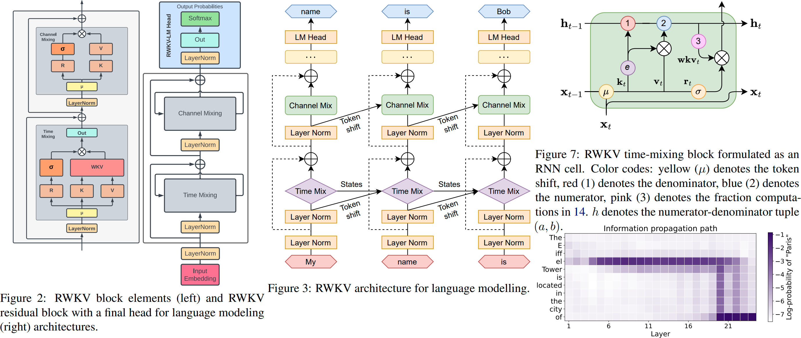

# RWKV: Parallelizable RNN with Transformer-level LM Performance , named from 4 major params: R W K V

RWKV(pronounced as "RwaKuv" (rʌkuv in IPA)) is an RNN with Transformer-level LLM performance, which can also be directly trained like a GPT transformer (parallelizable). And it's 100% attention-free. You only need the hidden state at position t to compute the state at position t+1. You can use the "GPT" mode to quickly compute the hidden state for the "RNN" mode.

So it's combining the best of RNN and transformer - **great performance, fast inference, saves VRAM, fast training, "infinite" ctx_len, and free sentence embedding** (using the final hidden state).


## Learn About RWKV 

- **RWKV homepage:** https://www.rwkv.com

- **RWKV-5/6 Eagle/Finch paper**: https://arxiv.org/abs/2404.05892

- **RWKV-6 GPT-mode demo code (with comments and explanations)**: https://github.com/BlinkDL/RWKV-LM/blob/main/RWKV-v5/rwkv_v6_demo.py

- **RWKV-6 RNN-mode demo:** https://github.com/BlinkDL/ChatRWKV/blob/main/RWKV_v6_demo.py

### Online Demo 

- **RWKV-6 3B Demo:**  https://huggingface.co/spaces/BlinkDL/RWKV-Gradio-1

- **RWKV-6 7B Demo:**  https://huggingface.co/spaces/BlinkDL/RWKV-Gradio-2


## Simple Usage 


## Jonis US 

## TRAINING RWKV

### HOW TO TEST TRAINING RWKV-5 on MiniPile (1.5G tokens) ###

#### Environmen For TRAINING RWKV

For reference, use python 3.10, torch==1.13.1+cu117, cuda 11.7.1 .

For best performance, use python 3.10, torch 2.1.2+cu121 (or latest), cuda 12.3+, **latest deepspeed**, but **keep pytorch-lightning==1.9.5**

```bash
reference:
pip install torch==1.13.1+cu117 --extra-index-url https://download.pytorch.org/whl/cu117
pip install pytorch-lightning==1.9.5 deepspeed==0.7.0 wandb ninja

best performance:
pip install torch --upgrade --extra-index-url https://download.pytorch.org/whl/cu121
pip install pytorch-lightning==1.9.5 deepspeed wandb ninja --upgrade

cd RWKV-v5/
./demo-training-prepare.sh
./demo-training-run.sh
(you may want to log in to wandb first)
```
Your loss curve should look almost exactly the same as this, with the same ups and downs (if you use the same bsz & config):


You can run your model using https://pypi.org/project/rwkv/ (use "rwkv_vocab_v20230424" instead of "20B_tokenizer.json")

#### Preparing dataset

Follow the steps below to prepare your training dataset.

1. **Convert jsonl data to binidx**

Use [`make_data.py`](https://github.com/BlinkDL/RWKV-LM/blob/main/RWKV-v5/make_data.py) to prepare binidx data from jsonl, and compute "`--my_exit_tokens`" and "`--magic_prime`".

> [!IMPORTANT]
> The "epoch" in train.py is "mini-epoch" (not real epoch. only for convenience), and 1 mini-epoch = 40320 * ctx_len tokens.
> 
> For example, if your binidx has 1498226207 tokens and ctxlen=4096, set "--my_exit_tokens 1498226207" (this will override epoch_count), and it will be 1498226207/(40320 * 4096) = 9.07 miniepochs. The trainer will auto-exit after "--my_exit_tokens" tokens. Set "--magic_prime" to the largest 3n+2 prime smaller than datalen/ctxlen-1 (= 1498226207/4096-1 = 365776), which is "--magic_prime 365759" in this case.

simple: prepare SFT jsonl => repeat your SFT data 3 or 4 times in make_data.py. more repetition leads to overfitting.

advanced: repeat your SFT data 3 or 4 times in your jsonl (note make_data.py will shuffle all jsonl items) => add some base data (such as slimpajama) to your jsonl => and only repeat 1 times in make_data.py.

**Train RWKV-6**: use /RWKV-v5/ and add --my_testing "x060" to demo-training-prepare.sh and demo-training-run.sh

**Simple inference for RWKV-5**: https://github.com/BlinkDL/ChatRWKV/blob/main/RWKV_v5_demo.py

**Simple inference for RWKV-6**: https://github.com/BlinkDL/ChatRWKV/blob/main/RWKV_v6_demo.py

lm_eval: https://github.com/BlinkDL/ChatRWKV/blob/main/run_lm_eval.py

chat demo for developers: https://github.com/BlinkDL/ChatRWKV/blob/main/API_DEMO_CHAT.py

**Tips for small model / small data**: When I train RWKV music models, I use deep & narrow (such as L29-D512) dimensions, and apply wd and dropout (such as wd=2 dropout=0.02). Note RWKV-LM dropout is very effective - use 1/4 of your usual value.

### HOW TO FINETUNE RWKV-5 MODELS ###

Use .jsonl format for your data (see https://huggingface.co/BlinkDL/rwkv-5-world for formats).

Use https://github.com/BlinkDL/RWKV-LM/blob/main/RWKV-v5/make_data.py to tokenizer it using World tokenizer into binidx, suitable for finetuning World models.

Rename the base checkpoint in your model folder to rwkv-init.pth, and change the training commands to use --n_layer 32 --n_embd 4096 --vocab_size 65536 --lr_init 1e-5 --lr_final 1e-5 for 7B.

0.1B = --n_layer 12 --n_embd 768 // 0.4B = --n_layer 24 --n_embd 1024 // 1.5B = --n_layer 24 --n_embd 2048 // 3B = --n_layer 32 --n_embd 2560 // 7B = --n_layer 32 --n_embd 4096

### State-tuning (tuning the initial state. zero inference overhead)

Currently unoptimized implementation, takes same vram as full SFT .

```--train_type "states" --load_partial 1 --lr_init 1 --lr_final 0.01 --warmup_steps 10 (yes, use very high LR)```

use rwkv 0.8.26+ to auto-load the trained "time_state" 

### Initializing RWKV 5/6 Models ###

When you train RWKV from scratch, try my initialization for best performance. Check generate_init_weight() of src/model.py:
```
emb.weight => nn.init.uniform_(a=-1e-4, b=1e-4)
(Note ln0 of block0 is the layernorm for emb.weight)
head.weight => nn.init.orthogonal_(gain=0.5*sqrt(n_vocab / n_embd))

att.receptance.weight => nn.init.orthogonal_(gain=1)
att.key.weight => nn.init.orthogonal_(gain=0.1)
att.value.weight => nn.init.orthogonal_(gain=1)
att.gate.weight => nn.init.orthogonal_(gain=0.1)
att.output.weight => zero

att.ln_x.weight (groupnorm) => ((1 + layer_id) / total_layers) ** 0.7

ffn.key.weight => nn.init.orthogonal_(gain=1)
ffn.value.weight => zero
ffn.receptance.weight => zero
```
!!! If you are using positional embedding, maybe it's better to remove block.0.ln0 and use default initialization for emb.weight instead of my uniform_(a=-1e-4, b=1e-4) !!!


# 

**RWKV Runner GUI** https://github.com/josStorer/RWKV-Runner with one-click install and API

**All latest RWKV weights:** https://huggingface.co/BlinkDL

**HF-compatible RWKV weights:** https://huggingface.co/RWKV

**RWKV pip package**: https://pypi.org/project/rwkv/

```python
os.environ["RWKV_JIT_ON"] = '1'
os.environ["RWKV_CUDA_ON"] = '0' # if '1' then use CUDA kernel for seq mode (much faster)
from rwkv.model import RWKV                         # pip install rwkv
model = RWKV(model='/fsx/BlinkDL/HF-MODEL/rwkv-4-pile-1b5/RWKV-4-Pile-1B5-20220903-8040', strategy='cuda fp16')

out, state = model.forward([187, 510, 1563, 310, 247], None)   # use 20B_tokenizer.json
print(out.detach().cpu().numpy())                   # get logits
out, state = model.forward([187, 510], None)
out, state = model.forward([1563], state)           # RNN has state (use deepcopy if you want to clone it)
out, state = model.forward([310, 247], state)
print(out.detach().cpu().numpy())                   # same result as above
```

**nanoRWKV**: https://github.com/BlinkDL/nanoRWKV (does not require custom CUDA kernel to train, works for any GPU/CPU)

## Star History

[](https://star-history.com/#BlinkDL/RWKV-LM&Date)


## Links of RWKV

**RWKV Discord**: https://discord.gg/bDSBUMeFpc (7k+ members)

**Twitter**: https://twitter.com/BlinkDL_AI

**Homepage**: https://www.rwkv.com

### Cool Community RWKV Projects

- **All (300+) RWKV projects:** https://github.com/search?o=desc&q=rwkv&s=updated&type=Repositories

- **Vision RWKV:** https://github.com/OpenGVLab/Vision-RWKV 

- **Diffusion RWKV:** https://github.com/feizc/Diffusion-RWKV 

- **Ai00-server:** https://github.com/cgisky1980/ai00_rwkv_server Fastest WebGPU inference (nVidia/AMD/Intel), supports rwkv5 & rwkv6

- **web-rwkv:** https://github.com/cryscan/web-rwkv backend for ai00_rwkv_server

- **rwkv.cpp**:https://github.com/saharNooby/rwkv.cpp Fast CPU/cuBLAS/CLBlast inference: int4/int8/fp16/fp32, supports rwkv5

- **faster-rwkv:** https://github.com/daquexian/faster-rwkv supports rwkv5

- **MLC LLM supports rwkv5:** https://github.com/mlc-ai/mlc-llm/pull/1275 

- **Infctx trainer:** https://github.com/RWKV/RWKV-infctx-trainer 

- **LoRA finetuning:** https://github.com/Blealtan/RWKV-LM-LoRA 

- **Digital Assistant with RWKV:** https://github.com/TheRamU/Fay 

- **rwkv-cpp-cuda:** https://github.com/harrisonvanderbyl/rwkv-cpp-cuda Fast GPU inference with cuda/amd/vulkan

- **RWKV v6 in 250 lines** (with tokenizer too): https://github.com/BlinkDL/ChatRWKV/blob/main/RWKV_v6_demo.py

- **RWKV v5 in 250 lines** (with tokenizer too): https://github.com/BlinkDL/ChatRWKV/blob/main/RWKV_v5_demo.py

- **RWKV v4 in 150 lines** (model, inference, text generation): https://github.com/BlinkDL/ChatRWKV/blob/main/RWKV_in_150_lines.py

- **RWKV v4 preprint** https://arxiv.org/abs/2305.13048



**RWKV v4 introduction, and in 100 lines of numpy**: https://johanwind.github.io/2023/03/23/rwkv_overview.html https://johanwind.github.io/2023/03/23/rwkv_details.html

RWKV v6 illustrated:


A cool paper (Spiking Neural Network) using RWKV: https://github.com/ridgerchu/SpikeGPT


## How it works

RWKV is inspired by Apple's AFT (https://arxiv.org/abs/2105.14103).

Moreover it's using a number of my tricks, such as:

* SmallInitEmb: https://github.com/BlinkDL/SmallInitEmb (applicable to all transformers) which helps the embedding quality, and stabilizes Post-LN (which is what I am using).

* Token-shift: https://github.com/BlinkDL/RWKV-LM#token-shift-time-shift-mixing (applicable to all transformers), especially helpful for char-level models.

* Head-QK: https://github.com/BlinkDL/RWKV-LM#the-head-qk-trick-learning-to-copy-and-avoid-tokens (applicable to all transformers). Note: it's helpful, but I disabled it in the Pile model to keep it 100% RNN.

* Extra R-gate in the FFN (applicable to all transformers). I am also using reluSquared from Primer.

* Better initilization: I init most of the matrices to ZERO (see RWKV_Init in https://github.com/BlinkDL/RWKV-LM/blob/main/RWKV-v2-RNN/src/model.py).

* You can transfer some parameters from a small model to a large model (note: I sort & smooth them too), for faster and better convergence (see https://www.reddit.com/r/MachineLearning/comments/umq908/r_rwkvv2rnn_a_parallelizable_rnn_with/).

* My CUDA kernel: https://github.com/BlinkDL/RWKV-CUDA to speedup training.

