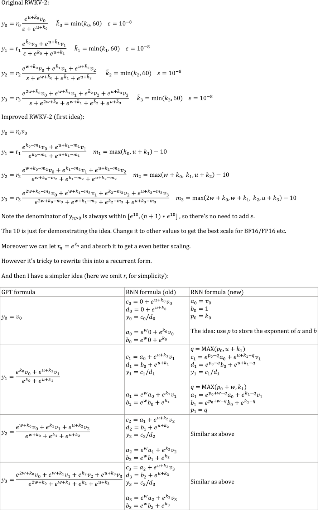
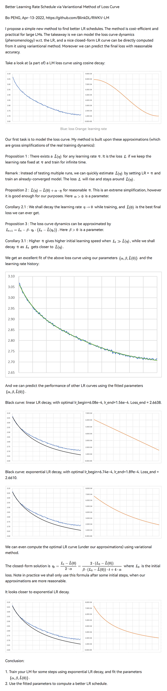

# RWKV-V3

> [!NOTE]
> 
> **The following content is an archive of RWKV-V3 content, RWKV-V3 [first committed](https://github.com/BlinkDL/RWKV-LM/commit/09132dea52a201f67251a8f802d6a5f5b4a3695b) on Jun 27, 2022** 


## Explaining the code for RWKV-3 GPT mode

### The GPT mode - overview

The building blocks of RWKV-3 GPT mode are similar to that of a usual preLN GPT.

The only difference is an extra LN after embedding. Note you can absorb this LN into the embedding after finishing the training.
```python
x = self.emb(idx)  # input: idx = token indices
x = self.ln_emb(x) # extra LN after embedding
x = x + self.att_0(self.ln_att_0(x)) # preLN
x = x + self.ffn_0(self.ln_ffn_0(x))
...
x = x + self.att_n(self.ln_att_n(x))
x = x + self.ffn_n(self.ln_ffn_n(x))
x = self.ln_head(x) # final LN before projection
x = self.head(x)    # output: x = logits
```
It is important to initialize emb to tiny values, such as nn.init.uniform_(a=-1e-4, b=1e-4), to utilize my trick https://github.com/BlinkDL/SmallInitEmb.

For the 1.5B RWKV-3, I use Adam (no wd, no dropout) optimizer on 8 * A100 40G.

batchSz = 32 * 896, ctxLen = 896. I am using tf32 so the batchSz is a bit small. 

For the first 15B tokens, LR is fixed at 3e-4, and beta=(0.9, 0.99).

Then I set beta=(0.9, 0.999), and do an exponential decay of LR, reaching 1e-5 at 332B tokens.

### The GPT mode - ATT block

The RWKV-3 does not have any attention in the usual sense, but we will call this block ATT anyway.
```python
B, T, C = x.size() # x = (Batch,Time,Channel)

# Mix x with the previous timestep to produce xk, xv, xr
xx = self.time_shift(x) # self.time_shift = nn.ZeroPad2d((0,0,1,-1))
xk = x * self.time_mix_k + xx * (1 - self.time_mix_k)
xv = x * self.time_mix_v + xx * (1 - self.time_mix_v)
xr = x * self.time_mix_r + xx * (1 - self.time_mix_r)

# Use xk, xv, xr to produce k, v, r
k = self.key(xk).transpose(-1, -2)
v = self.value(xv).transpose(-1, -2)
r = self.receptance(xr)
k = torch.clamp(k, max=60) # clamp k to avoid overflow
k = torch.exp(k)
kv = k * v

# Compute the W-curve = [e^(-n * e^time_decay), e^(-(n-1) * e^time_decay), ..., 1, e^(time_first)]
self.time_w = torch.cat([torch.exp(self.time_decay) * self.time_curve.to(x.device), self.time_first], dim=-1)
w = torch.exp(self.time_w)

# Use W to mix kv and k respectively. Add K_EPS to wk to avoid divide-by-zero
if RUN_DEVICE == 'cuda':
    wkv = TimeX.apply(w, kv, B,C,T, 0)
    wk = TimeX.apply(w, k, B,C,T, K_EPS)
else:
    w = w[:,-T:].unsqueeze(1)
    wkv = F.conv1d(nn.ZeroPad2d((T-1, 0, 0, 0))(kv), w, groups=C)
    wk = F.conv1d(nn.ZeroPad2d((T-1, 0, 0, 0))(k), w, groups=C) + K_EPS

# The RWKV formula
rwkv = torch.sigmoid(r) * (wkv / wk).transpose(-1, -2)
rwkv = self.output(rwkv) # final output projection
```

The self.key, self.receptance, self.output matrices are all initialized to zero.

The time_mix, time_decay, time_first vectors are transferred from a smaller trained model (note: I sort & smooth them too).

### The GPT mode - FFN block

The FFN block has three tricks comparing with the usual GPT:

1. My time_mix trick.

2. The sqReLU from the Primer paper.

3. An extra receptance-gate (similar to the receptance-gate in ATT block).
```python
# Mix x with the previous timestep to produce xk, xr
xx = self.time_shift(x)
xk = x * self.time_mix_k + xx * (1 - self.time_mix_k)
xr = x * self.time_mix_r + xx * (1 - self.time_mix_r)

# The usual FFN operation
k = self.key(xk)
k = torch.square(torch.relu(k)) # from the Primer paper
kv = self.value(k)

# Apply an extra receptance-gate to kv
rkv = torch.sigmoid(self.receptance(xr)) * kv
return rkv
```
The self.value, self.receptance matrices are all initialized to zero.

## RWKV-4 improvements



## From GPT to RWKV (the formulas)

Let F[t] be the system state at t.

Let x[t] be the new external input at t.

In GPT, predicting F[t+1] requires considering F[0], F[1], .. F[t]. So it takes O(T^2) to generate a length T sequence.

The **simplified formula** for GPT:

![F[\mathrm{t}+1]=\frac{\sum_{\mathrm{i}=0}^{\mathrm{t}} \exp (\mathbf{Q}x[\mathrm{t}] * \mathbf{K}F[\mathrm{i}]) \cdot(\mathbf{V}F[\mathrm{i}])}{\sum_{\mathrm{i}=0}^{\mathrm{t}} \exp (\mathbf{Q}x[\mathrm{t}] * \mathbf{K}F[\mathrm{i}])}](https://render.githubusercontent.com/render/math?math=%5Ccolor%7Bblack%7D%5Cdisplaystyle+F%5B%5Cmathrm%7Bt%7D%2B1%5D%3D%5Cfrac%7B%5Csum_%7B%5Cmathrm%7Bi%7D%3D0%7D%5E%7B%5Cmathrm%7Bt%7D%7D+%5Cexp+%28%5Cmathbf%7BQ%7Dx%5B%5Cmathrm%7Bt%7D%5D+%2A+%5Cmathbf%7BK%7DF%5B%5Cmathrm%7Bi%7D%5D%29+%5Ccdot%28%5Cmathbf%7BV%7DF%5B%5Cmathrm%7Bi%7D%5D%29%7D%7B%5Csum_%7B%5Cmathrm%7Bi%7D%3D0%7D%5E%7B%5Cmathrm%7Bt%7D%7D+%5Cexp+%28%5Cmathbf%7BQ%7Dx%5B%5Cmathrm%7Bt%7D%5D+%2A+%5Cmathbf%7BK%7DF%5B%5Cmathrm%7Bi%7D%5D%29%7D)

It's very capable in theory, however that **does not mean we can fully utilize its capability with usual optimizers**. I suspect the loss landscape is too difficult for our current methods.

Compare with the **simplified formula** for RWKV (the parallel mode, looks similar to Apple's AFT):

![F[\mathrm{t}+1]=\sigma(\mathbf{R}x[\mathrm{t}]) \cdot \frac{\sum_{\mathrm{i}=0}^{\mathrm{t}} \exp (\mathbf{W} \cdot(\mathrm{t}-\mathrm{i})) \cdot \exp (\mathbf{K}F[\mathrm{i}]) \cdot(\mathbf{V}F[\mathrm{i}])}{\sum_{\mathrm{i}=0}^{\mathrm{t}} \exp (\mathbf{W} \cdot(\mathrm{t}-\mathrm{i})) \cdot \exp (\mathbf{K }F[\mathrm{i}])}](https://render.githubusercontent.com/render/math?math=%5Ccolor%7Bblack%7D%5Cdisplaystyle+F%5B%5Cmathrm%7Bt%7D%2B1%5D%3D%5Csigma%28%5Cmathbf%7BR%7Dx%5B%5Cmathrm%7Bt%7D%5D%29+%5Ccdot+%5Cfrac%7B%5Csum_%7B%5Cmathrm%7Bi%7D%3D0%7D%5E%7B%5Cmathrm%7Bt%7D%7D+%5Cexp+%28%5Cmathbf%7BW%7D+%5Ccdot%28%5Cmathrm%7Bt%7D-%5Cmathrm%7Bi%7D%29%29+%5Ccdot+%5Cexp+%28%5Cmathbf%7BK%7DF%5B%5Cmathrm%7Bi%7D%5D%29+%5Ccdot%28%5Cmathbf%7BV%7DF%5B%5Cmathrm%7Bi%7D%5D%29%7D%7B%5Csum_%7B%5Cmathrm%7Bi%7D%3D0%7D%5E%7B%5Cmathrm%7Bt%7D%7D+%5Cexp+%28%5Cmathbf%7BW%7D+%5Ccdot%28%5Cmathrm%7Bt%7D-%5Cmathrm%7Bi%7D%29%29+%5Ccdot+%5Cexp+%28%5Cmathbf%7BK+%7DF%5B%5Cmathrm%7Bi%7D%5D%29%7D)

The R, K, V are trainable matrices, and W is a trainable vector (time-decay factor for each channel).

In GPT, the contribution of F[i] to F[t+1] is weighted by ![ \exp (\mathbf{Q}x[\mathrm{t}] * \mathbf{K}F[\mathrm{i}]) ](https://render.githubusercontent.com/render/math?math=%5Ccolor%7Bblack%7D%5Cdisplaystyle++%5Cexp+%28%5Cmathbf%7BQ%7Dx%5B%5Cmathrm%7Bt%7D%5D+%2A+%5Cmathbf%7BK%7DF%5B%5Cmathrm%7Bi%7D%5D%29+).

In RWKV-2, the contribution of F[i] to F[t+1] is weighted by ![\sigma(\mathbf{R}x[\mathrm{t}]) \cdot \exp (\mathbf{W} \cdot(\mathrm{t}-\mathrm{i})) \cdot \exp (\mathbf{K}F[\mathrm{i}]) ](https://render.githubusercontent.com/render/math?math=%5Ccolor%7Bblack%7D%5Cdisplaystyle+%5Csigma%28%5Cmathbf%7BR%7Dx%5B%5Cmathrm%7Bt%7D%5D%29+%5Ccdot+%5Cexp+%28%5Cmathbf%7BW%7D+%5Ccdot%28%5Cmathrm%7Bt%7D-%5Cmathrm%7Bi%7D%29%29+%5Ccdot+%5Cexp+%28%5Cmathbf%7BK%7DF%5B%5Cmathrm%7Bi%7D%5D%29+).
* The  is a non-linearity and we can use sigmoid. 
* Note ![\sigma(\mathbf{R}x[\mathrm{t}])](https://render.githubusercontent.com/render/math?math=%5Ccolor%7Bblack%7D%5Cdisplaystyle+%5Csigma%28%5Cmathbf%7BR%7Dx%5B%5Cmathrm%7Bt%7D%5D%29) is not in the denominator, and I call R the "receptance".
* The  is the time-decay factor. I proposed the same idea (scaling the attention by distance) in Aug 2020 and called it the "time-weighting" (check the commit history of https://github.com/BlinkDL/minGPT-tuned).

Here comes the punchline: we can rewrite it into a RNN (recursive formula). Note:

![F[1]=\sigma(\mathbf{R }x[0]) \cdot \frac{ \exp (\mathbf{K }F[0]) \cdot(\mathbf{V }F[0])}{\exp (\mathbf{K }F[0])}](https://render.githubusercontent.com/render/math?math=%5Ccolor%7Bblack%7D%5Cdisplaystyle+F%5B1%5D%3D%5Csigma%28%5Cmathbf%7BR+%7Dx%5B0%5D%29+%5Ccdot+%5Cfrac%7B+%5Cexp+%28%5Cmathbf%7BK+%7DF%5B0%5D%29+%5Ccdot%28%5Cmathbf%7BV+%7DF%5B0%5D%29%7D%7B%5Cexp+%28%5Cmathbf%7BK+%7DF%5B0%5D%29%7D)

![F[2]=\sigma(\mathbf{R }x[1]) \cdot \frac{ \exp (\mathbf{K }F[1]) \cdot(\mathbf{V }F[1])+\exp (\mathbf{W} ) \cdot \exp (\mathbf{K }F[0]) \cdot(\mathbf{V }F[0])}{ \exp (\mathbf{K }F[1])+\exp (\mathbf{W} ) \cdot \exp (\mathbf{K }F[0])}](https://render.githubusercontent.com/render/math?math=%5Ccolor%7Bblack%7D%5Cdisplaystyle+F%5B2%5D%3D%5Csigma%28%5Cmathbf%7BR+%7Dx%5B1%5D%29+%5Ccdot+%5Cfrac%7B+%5Cexp+%28%5Cmathbf%7BK+%7DF%5B1%5D%29+%5Ccdot%28%5Cmathbf%7BV+%7DF%5B1%5D%29%2B%5Cexp+%28%5Cmathbf%7BW%7D+%29+%5Ccdot+%5Cexp+%28%5Cmathbf%7BK+%7DF%5B0%5D%29+%5Ccdot%28%5Cmathbf%7BV+%7DF%5B0%5D%29%7D%7B+%5Cexp+%28%5Cmathbf%7BK+%7DF%5B1%5D%29%2B%5Cexp+%28%5Cmathbf%7BW%7D+%29+%5Ccdot+%5Cexp+%28%5Cmathbf%7BK+%7DF%5B0%5D%29%7D)

Therefore it's straightforward to verify:

![F[t+1]=\sigma(\mathbf{R }x[t]) \cdot \frac{\exp (\mathbf{K}F[\mathrm{t}]) \cdot(\mathbf{V}F[\mathrm{t}])+\exp (\mathbf{W}) \cdot A[\mathrm{t}]}{ \exp (\mathbf{K}F[\mathrm{t}])+\exp (\mathbf{W}) \cdot B[\mathrm{t}]}](https://render.githubusercontent.com/render/math?math=%5Ccolor%7Bblack%7D%5Cdisplaystyle+F%5Bt%2B1%5D%3D%5Csigma%28%5Cmathbf%7BR+%7Dx%5Bt%5D%29+%5Ccdot+%5Cfrac%7B%5Cexp+%28%5Cmathbf%7BK%7DF%5B%5Cmathrm%7Bt%7D%5D%29+%5Ccdot%28%5Cmathbf%7BV%7DF%5B%5Cmathrm%7Bt%7D%5D%29%2B%5Cexp+%28%5Cmathbf%7BW%7D%29+%5Ccdot+A%5B%5Cmathrm%7Bt%7D%5D%7D%7B+%5Cexp+%28%5Cmathbf%7BK%7DF%5B%5Cmathrm%7Bt%7D%5D%29%2B%5Cexp+%28%5Cmathbf%7BW%7D%29+%5Ccdot+B%5B%5Cmathrm%7Bt%7D%5D%7D)

where A[t] and B[t] are the numerator and denominator of the previous step, respectively.

I believe RWKV is performant because W is like repeatedly applying a diagonal matrix. Note (P^{-1} D P)^n = P^{-1} D^n P, so it is similar to repeatedly applying a general diagonalizable matrix.

Moreover it's possible to turn it into a continuous ODE (a bit similar to State Space Models). I will write about it later.


## How to sample a large dataset (for training)

I am using a trick to sample the Pile deterministically yet randomly enough.

Let's say the pile has x chunks (a chunk = ctx_len tokens).

pick a prime number p just less than x, and make sure p = 2 (mod 3).

Use (step * step * step) mod p to sample it. Add some bias to step for extra randomness.

## The top-p-x sampling method (for inference)

We propose a new sampling method called top-p-x:

it's like top-p, and the only difference is you also keep all tokens whose prob > x.

Try x = 0.01 first.

## Better Learning Rate Schedule via Variantional Method of Loss Curve

I propose a simple new method to find better LR schedules. The method is cost-efficient and practical for large LMs. The takeaway is we can model the loss curve dynamics (phenomenology) w.r.t. the LR, and a nice closed-form LR curve can be directly computed from it using variantional method. Moreover we can predict the final loss with reasonable accuracy.

UPDATE: In "Conclusion 1.", use the best-fitting regime (ignore the initial steps where our approximations break down) to fit the parameters.

Try this: fixed lr for 1 hr, then exponential decay to 0.2 * lr in 12 hrs, and choose the t=[1hr, 13hr] segment.

In the last three plots, black = predicted loss curve of the new LR schedule, blue = original (unoptimized) real loss curve, orange = new LR schedule.




