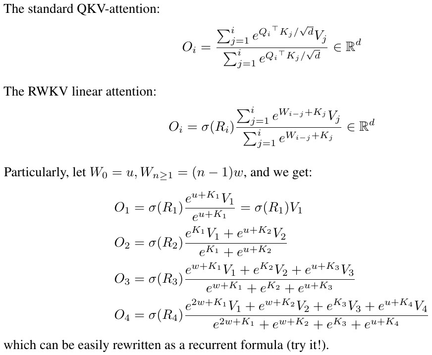

# RWKV-V4

>  [!NOTE]
> 
>  **The following content is an archive of RWKV-V4 content, RWKV-V4 is a large version of RWKV.** 

## Quick start

**IMPORTANT: Use deepspeed==0.7.0 pytorch-lightning==1.9.5 torch==1.13.1+cu117 and cuda 11.7.1 or 11.7 (note torch2 + deepspeed has weird bugs and hurts model performance)**

Use https://github.com/BlinkDL/RWKV-LM/tree/main/RWKV-v4neo (latest code, compatible with v4).

Here is a great prompt for testing Q&A of LLMs. Works for any model: (found by minimizing ChatGPT ppls for RWKV 1.5B)
```python
prompt = f'\nQ & A\n\nQuestion:\n{qq}\n\nDetailed Expert Answer:\n' # let the model generate after this
```


### Inference

**Run RWKV-4 Pile models:** Download models from https://huggingface.co/BlinkDL. Set TOKEN_MODE = 'pile' in run.py and run it. It's fast even on CPU (the default mode).

**Colab for RWKV-4 Pile 1.5B**: https://colab.research.google.com/drive/1F7tZoPZaWJf1fsCmZ5tjw6sYHiFOYVWM

Run RWKV-4 Pile models in your browser (and onnx version): see this issue https://github.com/BlinkDL/RWKV-LM/issues/7

RWKV-4 Web Demo: https://josephrocca.github.io/rwkv-v4-web/demo/ (note: only greedy sampling for now)

For the old RWKV-2: see the release here for a 27M params model on enwik8 with 0.72 BPC(dev). Run run.py in https://github.com/BlinkDL/RWKV-LM/tree/main/RWKV-v2-RNN. You can even run it in your browser: https://github.com/BlinkDL/AI-Writer/tree/main/docs/eng https://blinkdl.github.io/AI-Writer/eng/ (this is using tf.js WASM single-thread mode).

### Training / Fine-tuning

pip install deepspeed==0.7.0 // pip install pytorch-lightning==1.9.5 // torch 1.13.1+cu117

NOTE: add weight decay (0.1 or 0.01) and dropout (0.1 or 0.01) when training on small amt of data. try x=x+dropout(att(x)) x=x+dropout(ffn(x)) x=dropout(x+att(x)) x=dropout(x+ffn(x)) etc.

**Training RWKV-4 from scratch:** run train.py, which by default is using the enwik8 dataset (unzip https://data.deepai.org/enwik8.zip).

You will be training the "GPT" version because it's paralleziable and faster to train. RWKV-4 can extrapolate, so training with ctxLen 1024 can work for ctxLen of 2500+. You can fine-tune the model with longer ctxLen and it can quickly adapt to longer ctxLens.

**Fine-tuning RWKV-4 Pile models:** use 'prepare-data.py' in https://github.com/BlinkDL/RWKV-v2-RNN-Pile/tree/main/RWKV-v3 to tokenize .txt into train.npy data. Then use https://github.com/BlinkDL/RWKV-LM/blob/main/RWKV-v4neo/train.py to train it.

Read the inference code in src/model.py and try using the final hidden state（.xx .aa .bb) as a faithful sentence embedding for other tasks. Probably you should begin with .xx and .aa/.bb (.aa divided by .bb).

Colab for fine-tuning RWKV-4 Pile models: https://colab.research.google.com/github/resloved/RWKV-notebooks/blob/master/RWKV_v4_RNN_Pile_Fine_Tuning.ipynb

**Large corpus:** Use https://github.com/Abel2076/json2binidx_tool to convert .jsonl into .bin and .idx

The jsonl format sample (one line for each document):
```
{"text": "This is the first document."}
{"text": "Hello\nWorld"}
{"text": "1+1=2\n1+2=3\n2+2=4"}
```
generated by code like this:
```
ss = json.dumps({"text": text}, ensure_ascii=False)
out.write(ss + "\n")
```

**Infinite ctxlen training (WIP):** https://github.com/Blealtan/RWKV-LM-LoRA/tree/dev-infctx

### How to use RWKV hidden state as text embedding

Consider RWKV 14B. The state has 200 vectors, that is, 5 vectors for each block: fp16 (xx), fp32 (aa), fp32 (bb), fp32 (pp), fp16 (xx).

Do not avg pool because different vectors (xx aa bb pp xx) in the state have very different meanings and ranges. You can probably remove pp.

I suggest firstly collect the mean+stdev statistics of each channel of each vector, and normalize all of them (note: the normalization should be data-indepedent and collected from various texts). Then train a linear classifer.

## Towards RWKV-5 (just to record some new ideas)

### Lastest Design

RWKV-5 is multi-head and here shows one head. There is also a LayerNorm for each head (hence actually GroupNorm).

$`
\begin{array}{|l|l|l|}
\hline & \text { RWKV-4 with real-valued } k \,\&\, v \,\&\, u \,\&\, w & \text { RWKV-5 with matrix-valued } \mathrm{k}^{\dagger} \mathrm{v} \,\&\, \mathrm{u} \,\&\, \mathrm{w} \\
\hline \mathrm{y}_0 & \mathrm{r}_0 \frac{\mathrm{uk}_0 \mathrm{v}_0}{\mathrm{uk}_0} & \mathrm{r}_0\left(\mathrm{uk}_0^{\dagger} \mathrm{v}_0\right) \\
\hline \mathrm{y}_1 & \mathrm{r}_1 \frac{\mathrm{uk}_1 \mathrm{v}_1+\mathrm{k}_0 \mathrm{v}_0}{\mathrm{uk}_1+\mathrm{k}_0} & \mathrm{r}_1\left(\mathrm{uk}_1^{\dagger} \mathrm{v}_1+\mathrm{k}_0^{\dagger} \mathrm{v}_0\right) \\
\hline \mathrm{y}_2 & \mathrm{r}_2 \frac{\mathrm{uk}_2 \mathrm{v}_2+\mathrm{k}_1 \mathrm{v}_1+\mathrm{wk}_0 \mathrm{v}_0}{\mathrm{uk}_2+\mathrm{k}_1+\mathrm{wk}_0} & \mathrm{r}_2\left(\mathrm{uk}_2^{\dagger} \mathrm{v}_2+\mathrm{k}_1^{\dagger} \mathrm{v}_1+\mathrm{wk}_0^{\dagger} \mathrm{v}_0\right) \\
\hline \mathrm{y}_3 & \mathrm{r}_3 \frac{\mathrm{uk}_3 \mathrm{v}_3+\mathrm{k}_2 \mathrm{v}_2+\mathrm{wk}_1 \mathrm{v}_1+\mathrm{w}^2 \mathrm{k}_0 \mathrm{v}_0}{\mathrm{uk}_3+\mathrm{k}_2+\mathrm{wk}_1+\mathrm{w}^2 \mathrm{k}_0} & \mathrm{r}_3\left(\mathrm{uk}_3^{\dagger} \mathrm{v}_3+\mathrm{k}_2^{\dagger} \mathrm{v}_2+\mathrm{wk}_1^{\dagger} \mathrm{v}_1+\mathrm{w}^2 \mathrm{k}_0^{\dagger} \mathrm{v}_0\right) \\
\hline
\end{array}`$

$`\left[\begin{array}{ll}
\mathrm{y}_{20} & \cdots \mathrm{y}_{2 \mathrm{c}}
\end{array}\right]=\left[\begin{array}{lll}
\mathrm{r}_{20} & \cdots & \mathrm{r}_{2 \mathrm{c}}
\end{array}\right]`$
$`\left(\left[\begin{array}{ccc}
\mathrm{u}_{00} & \cdots & \mathrm{u}_{0 \mathrm{c}} \\
\vdots & \ddots & \vdots \\
\mathrm{u}_{\mathrm{c} 0} & \cdots & \mathrm{u}_{\mathrm{cc}}
\end{array}\right]\left[\begin{array}{ccc}
\mathrm{k}_{20} \mathrm{v}_{20} & \cdots & \mathrm{k}_{20} \mathrm{v}_{2 \mathrm{c}} \\
\vdots & \ddots & \vdots \\
\mathrm{k}_{2 \mathrm{c}} \mathrm{v}_{20} & \cdots & \mathrm{k}_{2 \mathrm{c}} \mathrm{v}_{2 \mathrm{c}}
\end{array}\right]+\left[\begin{array}{ccc}
\mathrm{k}_{10} \mathrm{v}_{10} & \cdots & \mathrm{k}_{10} \mathrm{v}_{1 \mathrm{c}} \\
\vdots & \ddots & \vdots \\
\mathrm{k}_{1 \mathrm{c}} \mathrm{v}_{10} & \cdots & \mathrm{k}_{1 \mathrm{c}} \mathrm{v}_{1 \mathrm{c}}
\end{array}\right]+\left[\begin{array}{ccc}
\mathrm{w}_{00} & \cdots & \mathrm{w}_{0 \mathrm{c}} \\
\vdots & \ddots & \vdots \\
\mathrm{w}_{\mathrm{c} 0} & \cdots & \mathrm{w}_{\mathrm{cc}}
\end{array}\right]\left[\begin{array}{ccc}
\mathrm{k}_{00} \mathrm{v}_{00} & \cdots & \mathrm{k}_{00} \mathrm{v}_{0 c} \\
\vdots & \ddots & \vdots \\
\mathrm{k}_{0 \mathrm{c}} \mathrm{v}_{00} & \cdots & \mathrm{k}_{0 \mathrm{c}} \mathrm{v}_{0 c}
\end{array}\right]
\right)`$

### RWKV-6

Dynamic Mix & Dynamic Decay. Example (do this for both TimeMix & ChannelMix):
```
TIME_MIX_EXTRA_DIM = 32
self.time_mix_k_w1 = nn.Parameter(torch.empty(args.n_embd, TIME_MIX_EXTRA_DIM).uniform_(-0.01, 0.01))
self.time_mix_k_w2 = nn.Parameter(torch.zeros(TIME_MIX_EXTRA_DIM, args.n_embd))
self.time_mix_v_w1 = nn.Parameter(torch.empty(args.n_embd, TIME_MIX_EXTRA_DIM).uniform_(-0.01, 0.01))
self.time_mix_v_w2 = nn.Parameter(torch.zeros(TIME_MIX_EXTRA_DIM, args.n_embd))
self.time_mix_r_w1 = nn.Parameter(torch.empty(args.n_embd, TIME_MIX_EXTRA_DIM).uniform_(-0.01, 0.01))
self.time_mix_r_w2 = nn.Parameter(torch.zeros(TIME_MIX_EXTRA_DIM, args.n_embd))
self.time_mix_g_w1 = nn.Parameter(torch.empty(args.n_embd, TIME_MIX_EXTRA_DIM).uniform_(-0.01, 0.01))
self.time_mix_g_w2 = nn.Parameter(torch.zeros(TIME_MIX_EXTRA_DIM, args.n_embd))
...
time_mix_k = self.time_mix_k.view(1,1,-1) + (x @ self.time_mix_k_w1) @ self.time_mix_k_w2
time_mix_v = self.time_mix_v.view(1,1,-1) + (x @ self.time_mix_v_w1) @ self.time_mix_v_w2
time_mix_r = self.time_mix_r.view(1,1,-1) + (x @ self.time_mix_r_w1) @ self.time_mix_r_w2
time_mix_g = self.time_mix_g.view(1,1,-1) + (x @ self.time_mix_g_w1) @ self.time_mix_g_w2

xx = self.time_shift(x)
xk = x * time_mix_k + xx * (1 - time_mix_k)
xv = x * time_mix_v + xx * (1 - time_mix_v)
xr = x * time_mix_r + xx * (1 - time_mix_r)
xg = x * time_mix_g + xx * (1 - time_mix_g)
```


### RWKV-7

Use parallelized mode to quickly generate the state, then use a finetuned full RNN (the layers of token n can use outputs of all layer of token n-1) for sequential generation.

### Some old ideas

1. Now time decay is like 0.999^T (0.999 is learnable). Change it to something like (0.999^T + 0.1) where 0.1 is learnable too. The 0.1 part will be kept forever. Or, A^T + B^T + C = fast-decay + slow-decay + constant. Can even use different formulas (for example, K^2 instead of e^K for a decay component, or, without normalization).

2. Use complex-valued decay (so, rotation instead of decay) in some channels.

3. Inject some trainable and extrapolatable positional encoding?

4. Aside from 2d rotation, we can try other Lie groups such as 3d rotation ( SO(3) ). Non-abelian RWKV lol.

5. RWKV might be great on analog devices (search for Analog Matrix-vector multiplication & Photonic Matrix-vector multiplication). The RNN mode is very hardware-friendly (processing-in-memory). Can be a SNN too (https://github.com/ridgerchu/SpikeGPT). I wonder if it can be optimized for quantum computation.

6. Trainable initial hidden state (xx aa bb pp xx).

7. Layerwise (or even row/column-wise, elementwise) LR, and test Lion optimizer.

### Vision Tasks

1. I find it's good to add a 2d pos encoding:
```
self.pos_emb_x = nn.Parameter(torch.zeros((1,args.my_pos_emb,args.n_embd)))
self.pos_emb_y = nn.Parameter(torch.zeros((args.my_pos_emb,1,args.n_embd)))
...
x = x + pos_emb_x + pos_emb_y
```

2. In a BPE langauge model, it's the best to use [tokenShift of 1 token] (you can mix more tokens in a char-level English model). However you can try [tokenShift of N (or N-1) (or N+1) tokens] if the image size is N x N, because that will be like mixing [the token above the current positon (or the token above the to-be-predicted positon)] with [current token]. You can use try different tokenShift styles for "ATT" & "FFN", or mixing different tokenShift styles - such as mixing [token A] with [token A-1] and [token A-(N-1)] etc.

### Misc

Maybe we can improve memorization by simply repeating the context (I guess 2 times is enough). Example:  Reference -> Reference(again) -> Question -> Answer

#### Idea: Bytes-aware Embedding

The idea is to make sure each token in vocab understand its length and raw UTF-8 bytes.

Let a = max(len(token)) for all token in vocab. Define AA : float[a][d_emb]

Let b = max(len_in_utf8_bytes(token)) for all token in vocab. Define BB : float[b][256][d_emb]

For each token X in vocab, let [x0, x1, ..., xn] be its raw UTF-8 bytes. We will add some extra values to its embedding EMB(X):

EMB(X) += AA[len(X)] + BB[0][x0] + BB[1][x1] + ... + BB[n][xn] (note: AA BB are learnable weights)

* We can do this for the final Linear(d_emb, n_vocab) projection too.
* We can use some small networks to generate AA and BB, for some extra regularization (for example, BB[m][xi] and BB[n][xi] should be related).

#### Old Idea

I have an idea to improve tokenization. We can hardcode some channels to have meanings. Example:

Channel 0 = "space"

Channel 1 = "capitalize first letter"

Channel 2 = "capitalize all letters"

Therefore:

Embedding of "abc":  [0, 0, 0, x0, x1, x2 , ..]

Embedding of " abc":  [1, 0, 0, x0, x1, x2, ..]

Embedding of " Abc":  [1, 1, 0, x0, x1, x2, ..]

Embedding of "ABC": [0, 0, 1, x0, x1, x2, ...]

......

so they will share most of the embedding. And we can rapidly compute the output probability of all variations of "abc".

Note: the above method is assuming that p(" xyz") / p("xyz") is the same for any "xyz", which can be wrong.

Better: define emb_space emb_capitalize_first emb_capitalize_all to be a function of emb.

Maybe the Best: let 'abc' ' abc' etc. to share the last 90% of their embeddings.

At this moment, all our tokenizers spend too many items to represent all variations of 'abc' ' abc' ' Abc' etc. Moreover the model cannot discover that these are actually similar if some of these variations are rare in the dataset. The method here can improve this. I plan to test this in a new version of RWKV.

#### Idea: Better Initial States

Example (single-round Q & A):

1. Generate the final state of all wiki documents.

2. For any user Q, find the best wiki document, and use its final state as the initial state.

3. Train a model to directly generate the optimal initial state for any user Q.

However this can be a bit more tricky for multi-round Q & A :)

## Join US !

You are welcome to join the RWKV discord https://discord.gg/bDSBUMeFpc to build upon it. We have plenty of potential compute (A100 40Gs) now (thanks to Stability and EleutherAI), so if you have interesting ideas I can run them.


RWKV [loss vs token position] for 10000 ctx4k+ documents in Pile. RWKV 1B5-4k is mostly flat after ctx1500, but 3B-4k and 7B-4k and 14B-4k have some slopes, and they are getting better. This debunks the old view that RNNs cannot model long ctxlens. We can predict that RWKV 100B will be great, and RWKV 1T is probably all you need :)


ChatRWKV with RWKV 14B ctx8192:


I believe RNN is a better candidate for fundamental models, because: (1) It's more friendly for ASICs (no kv cache). (2) It's more friendly for RL. (3) When we write, our brain is more similar to RNN. (4) The universe is like an RNN too (because of locality). Transformers are non-local models.

RWKV-3 1.5B on A40 (tf32) = always 0.015 sec/token, tested using simple pytorch code (no CUDA), GPU utilization 45%, VRAM 7823M

GPT2-XL 1.3B on A40 (tf32) = 0.032 sec/token (for ctxlen 1000), tested using HF, GPU utilization 45% too (interesting), VRAM 9655M

Training speed: (new training code) RWKV-4 14B BF16 ctxlen4096 = 114K tokens/s on 8x8 A100 80G (ZERO2+CP). (old training code) RWKV-4 1.5B BF16 ctxlen1024 = 106K tokens/s on 8xA100 40G.

I am doing image experiments too (For example: https://huggingface.co/BlinkDL/clip-guided-binary-autoencoder) and RWKV will be able to do txt2img diffusion :) My idea: 256x256 rgb image -> 32x32x13bit latents -> apply RWKV to compute transition probability for each of the 32x32 grid -> pretend the grids are independent and "diffuse" using these probabilities.

Smooth training - no loss spikes! (lr & bsz change around 15G tokens)


All of the trained models will be open-source. Inference is very fast (only matrix-vector multiplications, no matrix-matrix multiplications) even on CPUs, so you can even run a LLM on your phone.

How it works: RWKV gathers information to a number of channels, which are also decaying with different speeds as you move to the next token. It's very simple once you understand it.

**RWKV is parallelizable because the time-decay of each channel is data-independent (and trainable)**. For example, in usual RNN you can adjust the time-decay of a channel from say 0.8 to 0.5 (these are called "gates"), while in RWKV you simply move the information from a W-0.8-channel to a W-0.5-channel to achieve the same effect. Moreover, you can fine-tune RWKV into a non-parallelizable RNN (then you can use outputs of later layers of the previous token) if you want extra performance.



Here are some of my TODOs. Let's work together :)

* HuggingFace integration (check https://github.com/huggingface/transformers/issues/17230
), and optimized CPU & iOS & Android & WASM & WebGL inference. RWKV is a RNN and very friendly for edge devices. Let's make it possible to run a LLM on your phone. 

* Test it on bidirectional & MLM tasks, and image & audio & video tokens. I think RWKV can support Encoder-Decoder via this: for each decoder token, use a learned mixture of [decoder previous hidden state] & [encoder final hidden state]. Hence all decoder tokens will have access to the encoder output.

* Now training RWKV-4a with one single tiny extra attention (just a few extra lines comparing with RWKV-4) to further improve some difficult zeroshot tasks (such as LAMBADA) for smaller models. See https://github.com/BlinkDL/RWKV-LM/commit/a268cd2e40351ee31c30c5f8a5d1266d35b41829

User feedback:
> *I've so far toyed around the character-based model on our relatively small pre-training dataset (around 10GB of text), and the results are extremely good - similar ppl to models taking much, much longer to train.*

> *dear god rwkv is fast. i switched to another tab after starting training it from scratch & when i returned it was emitting plausible english & maori words, i left to go microwave some coffee & when i came back it was producing fully grammatically correct sentences.*

Tweet from Sepp Hochreiter (thank you!): https://twitter.com/HochreiterSepp/status/1524270961314484227

You can find me (BlinkDL) in the EleutherAI Discord too: https://www.eleuther.ai/get-involved/


